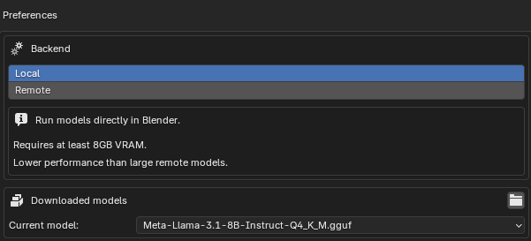
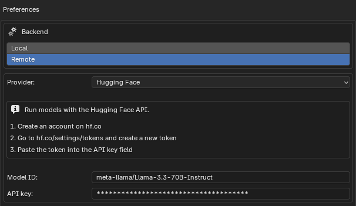
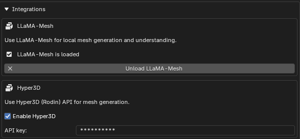

# MeshGen

Use AI Agents to control Blender with natural language.

## Features

-   Focused on AI as a tool, not replacement
-   Multiple backend options:
    -   Local inference with [llama.cpp](#local-backend) or [Ollama](#ollama)
    -   Remote inference with [Hugging Face](#hugging-face), [Anthropic](#anthropic), or [OpenAI](#openai)
-   Optional [LLaMA-Mesh](#llama-mesh) integration for local mesh understanding and generation
-   Optional [Hyper3D](#hyper3d) integration for high-fidelity 3D mesh generation

## Installation

1. Go to the [Latest Release](https://github.com/huggingface/meshgen/releases/latest) page
2. Download the addon ZIP file for your platform
3. In Blender, go to `Edit` -> `Preferences` -> `Add-ons` -> Top-Right Arrow -> `Install from Disk...`
4. Select the downloaded ZIP file

## Setup

1. In blender, go to `Edit` -> `Preferences` -> `Add-ons` -> `meshgen`
2. Select either [`Local`](#local-backend) or [`Remote`](#remote-backend) and follow instructions below

### Local Backend

Run models free locally directly in Blender.

Only select this option if you:

1. Have a powerful NVIDIA GPU with at least 8GB of VRAM
2. Installed a `cuda` version of the addon during [Installation](#installation)
3. Prefer running the model directly in Blender instead of a local [Ollama](#ollama) server

To set up the local backend, you can either:

1. Click `Download Recommended Model` to download [Meta-Llama-3.1-8B-Instruct-GGUF](https://huggingface.co/bartowski/Meta-Llama-3.1-8B-Instruct-GGUF)
2. Manually download a `.GGUF` model and put it in the models folder (located by clicking the folder icon)

### Remote Backend

MeshGen supports a variety of remote backends.

1. [Ollama](#ollama) to run models in a free local server
2. [Hugging Face](#hugging-face), [Anthropic](#anthropic), or [OpenAI](#openai) to run powerful models via API

[Hugging Face](#hugging-face) is recommended for most users, providing limited free use of powerful models.

#### Ollama

Run models free locally with an Ollama server.

1. Install [Ollama](https://ollama.com/)
2. Run `ollama serve` in the terminal
3. Select `Ollama` in the `Provider` dropdown
4. Enter your `Ollama` server endpoint and model name (the defaults should work for most users)

#### Hugging Face

Run a wide variety of models such as Llama, DeepSeek, Mistral, Qwen, and more via the Hugging Face API.

1. Create an account on [Hugging Face](https://huggingface.co/)
2. Go to [hf.co/settings/tokens](https://hf.co/settings/tokens) and create a new token
3. Select `Hugging Face` in the `Provider` dropdown
4. Enter your `Hugging Face` token in the `API Key` field
5. Optionally, change the `Model ID` to the model you want to use (e.g. `meta-llama/Llama-3.3-70B-Instruct`)

#### Anthropic

Run Anthropic models (i.e. Claude) with the Anthropic API.

1. Create an account on [Anthropic](https://console.anthropic.com/)
2. Go to [console.anthropic.com/settings/keys](https://console.anthropic.com/settings/keys) and create a new key
3. Select `Anthropic` in the `Provider` dropdown
4. Enter your `Anthropic` key in the `API Key` field
5. Optionally, change the `Model ID` to the model you want to use (e.g. `claude-3-5-sonnet-latest`)

#### OpenAI

Run OpenAI models (i.e. ChatGPT) with the OpenAI API.

1. Create an account on [OpenAI](https://platform.openai.com/)
2. Go to [platform.openai.com/api-keys](https://platform.openai.com/api-keys) and create a new secret key
3. Select `OpenAI` in the `Provider` dropdown
4. Enter your `OpenAI` secret key in the `API Key` field
5. Optionally, change the `Model ID` to the model you want to use (e.g. `gpt-4o-mini`)

## Optional Integrations

To enable optional integrations, go to `Edit` -> `Preferences` -> `Add-ons` -> `meshgen` -> `Integrations`.

When these are enabled, the agent will automatically be given access to these tools, depending on the context.

### LLaMA-Mesh

Use [LlamaMesh](https://github.com/nv-tlabs/LLaMA-Mesh) local mesh understanding and generation.

Only select this option if you:

1. Have a powerful NVIDIA GPU with at least 8GB of VRAM
2. Installed a `cuda` version of the addon during [Installation](#installation)
3. Are using a remote API backend (e.g. [Hugging Face](#hugging-face), [Anthropic](#anthropic), or [OpenAI](#openai)), as LLaMA-Mesh will load locally on your machine

To enable LLaMA-Mesh, click `Load LLama-Mesh` and wait for the model to load.

### Hyper3D

Use [Hyper3D](https://hyper3d.ai/) for high-fidelity 3D mesh generation.

To enable:

1. Check `Enable Hyper3D`
2. Enter your Hyper3D API key in the `API Key` field (free use is currently provided with the `awesomemcp` key)

This may take several minutes per mesh.

## Usage

-   Press `N` -> `MeshGen` (or `View` -> `Sidebar` -> Select the `MeshGen` tab)
-   Enter a prompt, for example: `Create a snowman`
-   Click `Submit`

## Troubleshooting

-   Find errors in the console:
    -   Windows: In Blender, go to `Window` -> `Toggle System Console`
    -   Mac/Linux: Launch Blender from the terminal
-   Report errors in [Issues](https://github.com/huggingface/meshgen/issues)
